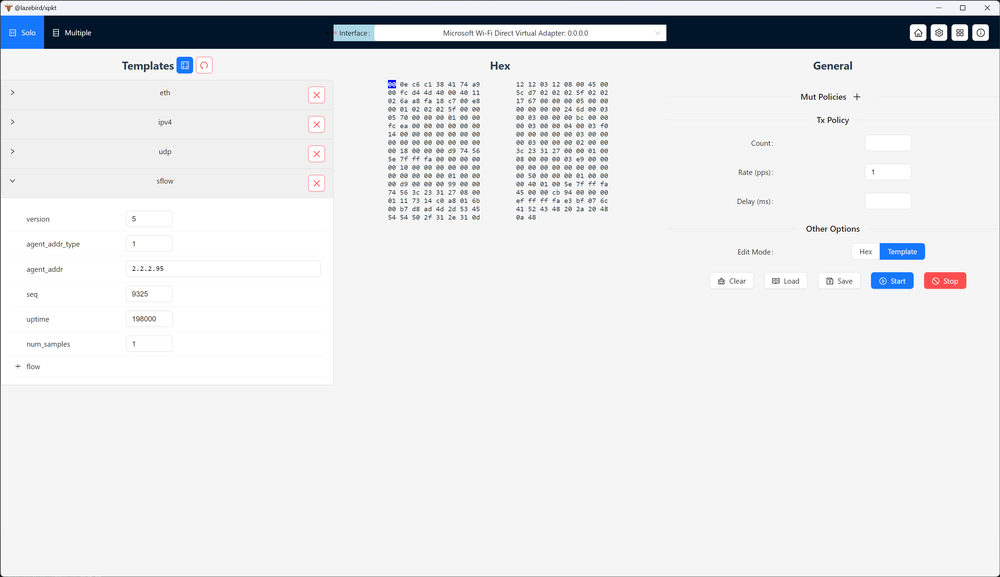
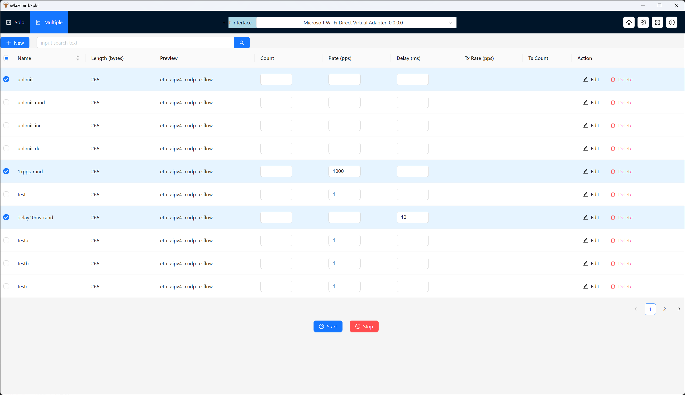
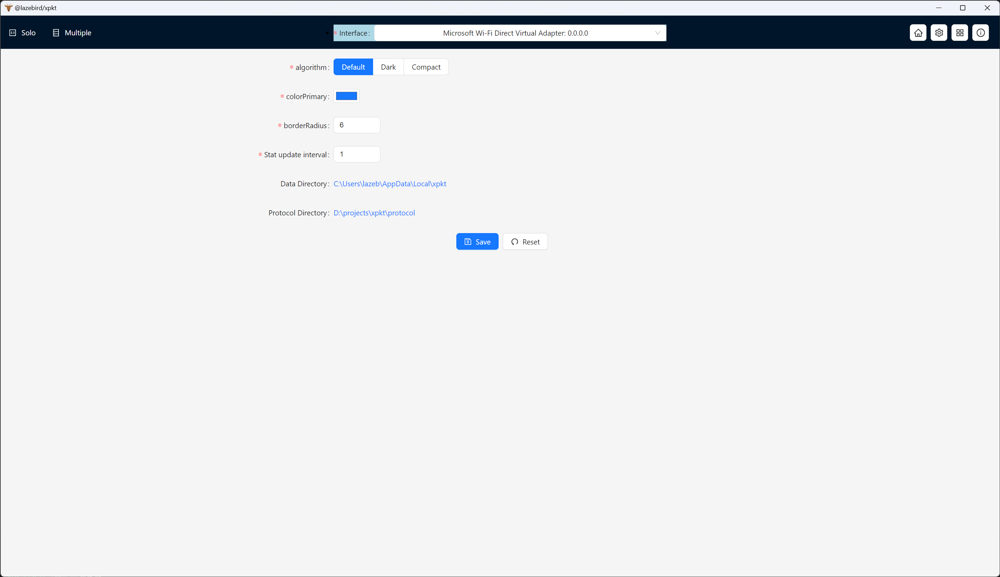
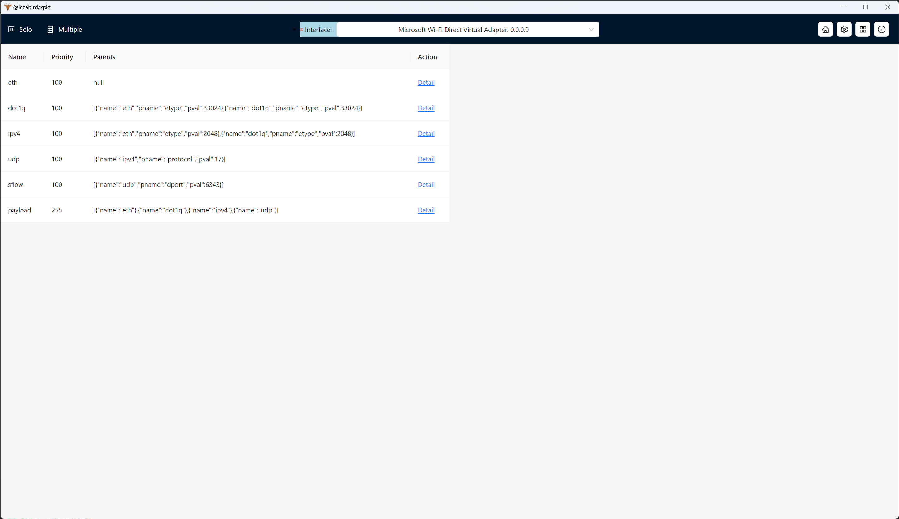

**This repository is used as a release and maintenance repository for xpkt software**

[中文说明](./README_zh.md)
# Table of contents
<!-- TOC -->

- [Table of contents](#table-of-contents)
- [Background](#background)
- [Basic introduction to xpkt](#basic-introduction-to-xpkt)
- [How to use](#how-to-use)
  - [xpkt flow build](#xpkt-flow-build)
  - [xpkt flow save](#xpkt-flow-save)
  - [multiple flows mode](#multiple-flows-mode)
- [xpkt protocol extension](#xpkt-protocol-extension)
  - [Development instructions](#development-instructions)
  - [Use extended protocols](#use-extended-protocols)
  - [Protocol processing rules](#protocol-processing-rules)
  - [Protocol processing ts definition](#protocol-processing-ts-definition)
- [Q\&A](#qa)
  - [What should I do if I encounter a bug or have a need?](#what-should-i-do-if-i-encounter-a-bug-or-have-a-need)

<!-- /TOC -->
# Background
- During the development process in the data communications field, it is often necessary to debug packets, and the outsourcing tool software will be used.
- There are existing advanced software such as anysend/xcap (windows platform) and packEth (linux platform) in the industry. I have used them all and benefited a lot.
- However, there are the following minor problems in the use of the above software
   - Cannot be used across platforms
   - The protocol support is not strong enough and the flexibility/expansibility is not enough
   - Performance is average, roughly around 1kpps
   - Software updates are slow and small problems are difficult to solve.
- Initially, it appears that the existing software is developed based on low-level languages such as c/c++ (packEth C is about 10kloc), and expansion and maintenance are relatively difficult. Therefore, we consider implementing a new outsourcing tool based on new technologies to provide another option for data communication students. I am very grateful to the senior software for providing you with the convinience and inspiration for this software.

# Basic introduction to xpkt
- xpkt is a professional free outsourcing tool software. It has the following characteristics:
- **Cross-platform contract testing tool**
- Dispatch:
     - Rich contracting strategies: rate, total number, etc.
     - Support field changes: including mac auto-increment/random, ip auto-increment/random, and general field type auto-increment/random
     - Powerful performance needs to be based on hardware conditions. Performance testing and comparison can be done later.
     - Multiple flows concurrently
- Build package:
     - Intuitive and powerful packet construction method
     - Structured quick editing + Hex professional editing coexist
     - Data compatible with mainflow formats/software
     - **Support extended protocol parsing capabilities**

# How to use
## xpkt flow build

- Click `Solo` in the navigation area, you can use templates or hex to build a flow, click `Edit Mode` at the right-bottom area to change mode.
- Click `Start` or `Stop` at the right-bottom area to send or stop the flow.

## xpkt flow save
- Click the `Save` button to save the flow. You must save your flows for multiple sent then.
- The saved flow will be saved in the configuration file and will not be lost even if the software is closed.

## multiple flows mode

- Click `Multiple` in the navigation area, you can see all your saved flows there. You can select them, change tx policies, and click `start` or `stop` to send or stop the selected flows

# xpkt protocol extension
## Development instructions
- For extended protocols, please refer to the protocol directory of this warehouse. The project natively uses ts language. The protocol directory is generated by executing `pnpm tsc` in the protocol_ts directory, with some modifications. What is finally read by the software is the protocol directory.
- Users can create their own protocol directory based on this warehouse and provide various customized protocol extensions. Everyone is also welcome to submit PRs to share their own protocol implementations.

## Use extended protocols

- You can modify the configuration of `Protocol Directory` by clicking on the settings page. The software will automatically load all **js files** in the configuration directory and try to parse them into protocol processing files.
- Therefore, users can implement protocol processing files by themselves, place them in a folder, and then configure the software to load user-defined protocol processing files to achieve the purpose of protocol expansion.


## Protocol processing rules
```js
// only core code snippets here
var initval = [0x00, 0x0e, 0xc6, 0xc1, 0x38, 0x41, 0x74, 0xa9, 0x12, 0x12, 0x03, 0x12, 0x08, 0x00];
const etypeOpts = [ { label: 'ipv4', value: '0x0800' }, { label: 'arp', value: '0x0806' } ];
function decode(arr, start) {
   var config = {
     key: 'eth',
     pos: [start, start + 13],
     children: [
       { key: 'dmac', value: array2mac(arr.slice(start, start + 6)), type: 'mac', pos: [start, start + 5], change: (arr, e) => mac_change( arr, e.pos, e.value) },
       { key: 'smac', value: array2mac(arr.slice(start + 6, start + 12)), type: 'mac', pos: [start + 6, start + 11], change: (arr, e) => mac_change(arr, e.pos, e.value) },
       { key: 'etype', value: num2hex(array2num(arr.slice(start + 12, start + 14))), options: etypeOpts, pos: [start + 12, start + 13], change: (arr, e ) => num_change(arr, e.pos, e.value, 2) },
     ],
   };
   return config;
}
export default { name: 'eth', parents: 'none', initval: initval, decode: decode, allow_payload: true };
```
- The above is a fragment of the eth protocol processing file. For more protocols, please refer to the built-in protocol processing script in the `/protocol` directory. For more details on each field, please refer to the ts definition.

## Protocol processing ts definition
- Refer to [protocol.d.ts](./types/protocol.d.ts)
```ts
interface ProtocolDecodeFn {
  (_arr: Array<number>, _start: number): ProtocolNode;
}

interface ProtocolChangeFn {
  (_arr: Array<number>, _e: ProtocolNode): Array<number>;
}

interface ProtocolCheckFn {
  (_arr: Array<number>, _e: ProtocolNode): any;
}
interface ProtocolCalcFn {
  (_arr: Array<number>, _e: ProtocolNode): Array<number>;
}

export interface ProtocolParentConfig {
  name: string;
  pname?: string;
  pval?: any;
}
export interface ProtocolNode {
  key: string;
  pos: Array<number>;
  children?: Array<ProtocolNode>;
  type?: 'number' | 'mac' | 'ipv4' | 'ipv6' | 'hex' | 'pkt';
  value?: any;
  options?: Array<any>;
  status?: 'error';
  change?: ProtocolChangeFn;
  check?: ProtocolCheckFn;
  calc?: ProtocolCalcFn;
}
export interface ProtocolConfig {
  name: string;
  priority?: number;
  parents: Array<ProtocolParentConfig> | null;
  initval: Array<number>;
  decode: ProtocolDecodeFn;
  allow_payload?: boolean;
}
```

# Q&A
## What should I do if I encounter a bug or have a need?
- You can submit issues on GitHub. Although it is a hobby, we will try our best to solve it.
