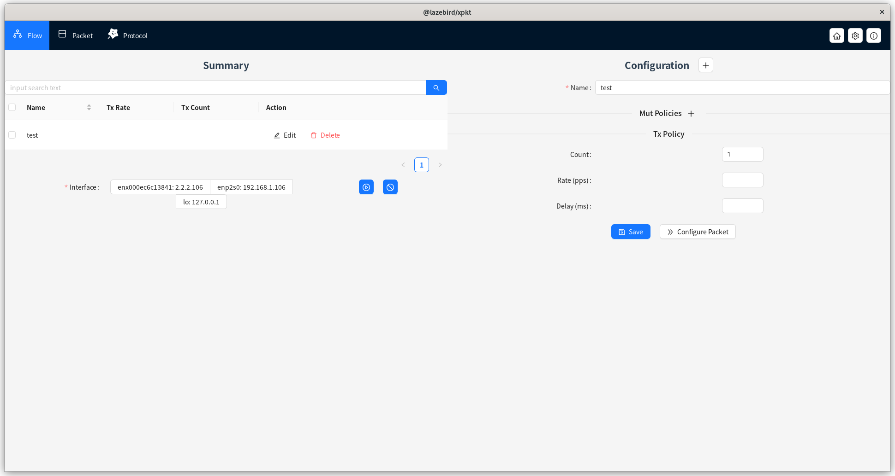
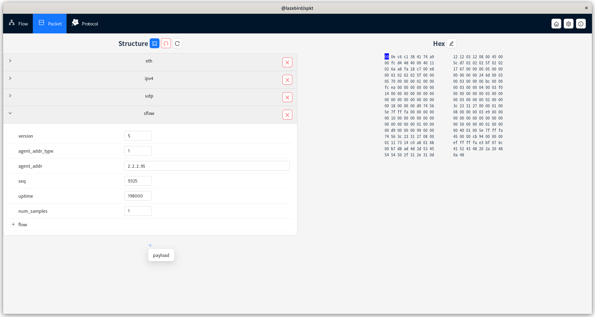

**This repository is used as a release and maintenance repository for xpkt software**

[中文说明](./README_zh.md)

# Table of contents
[TOC]

# Background
- During the development process in the data communications field, it is often necessary to debug packets, and the outsourcing tool software will be used.
- There are existing advanced software such as anysend/xcap (windows platform) and packEth (linux platform) in the industry. I have used them all and benefited a lot.
- However, there are the following minor problems in the use of the above software
   - Cannot be used across platforms
   - The protocol support is not strong enough and the flexibility/expansibility is not enough
   - Performance is average, roughly around 1kpps
   - Software updates are slow and small problems are difficult to solve.
- Initially, it appears that the existing software is developed based on low-level languages such as c/c++ (packEth C is about 10kloc), and expansion and maintenance are relatively difficult. Therefore, we consider implementing a new outsourcing tool based on new technologies to provide another option for data communication students. I am very grateful to the senior software for providing you with the traversal and inspiration for this software.

# Introduction to xpkt
- xpkt is a professional free outsourcing tool software. It has the following characteristics:
- **Cross-platform contract testing tool**
- Dispatch:
     - Rich contracting strategies: rate, total number, etc.
     - Support field changes: including mac auto-increment/random, ip auto-increment/random, and general field type auto-increment/random
     - Powerful performance needs to be based on hardware conditions. Performance testing and comparison can be done later.
     - Multiple flows concurrently
- Build package:
     - Intuitive and powerful packet construction method
     - Structured quick editing + Hex professional editing coexist
     - Data compatible with mainflow formats/software
     - **Support extended protocol parsing capabilities**

# How to use
## xpkt flow build

- Click `Flow` in the navigation area to enter the `Flow view`, as shown above, click the `+` next to `Configuration` in the right half of the area to add a new flow, or modify it based on the current flow. The following is the basic information:
   - Name: flow name, used to uniquely identify a flow
   - Mut Policies: Flow change policy, a policy used to dynamically adjust packet fields during packet sending.
     - Name: field name
     - Position: field position, only appears when the name is custom, manually configure the range of changes
     - Method: Change method, currently only supports decrease/increase/random
     - Step: change the step length, can only be configured when decreasing/increasing
   - Tx Policy: Tx policy
     - Count: The total number of packets sent, optional, no limit by default
     - Rate(pps): packet sending rate, optional, no limit by default
     - Delay(ms): delay of each packet, optional, no limit by default
- After configuring the basic flow information, you still need to configure specific packet content. You can click `Configure Packet` in the lower right corner to enter `Packet view`. See the next section for details.

## xpkt packet construction

- Click `Packet` in the navigation area to enter the `Packet view`, as shown above. packet editing has two modes
   - Structure editing mode: Structure editing mode refers to structured editing in the left half of the view. You can click the `+` button at the bottom to add new fields and modify the fields to quickly build packets.
   - Hex editing mode: Enter by clicking the `pen icon` next to `Hex` in the right half of the view. You can directly adjust the Hex data of the packet. After adjustment, click the confirmation button in the same position to complete the editing.

##xpkt flow save
- When the flow/packet editing is completed, please don’t forget to return to the `Flow view` and click the `Save` button to save the flow. The saved flow will be saved in the configuration file and will not be lost even if the software is closed.

##xpkt flow sending
- Return to the `Flow view`, you can see all the saved flows in the table in the left half of the area, check the flow, and specify the sending network card, click the `play icon` button to start packet sending; click the `stop icon `You can end the contract sending
- Note: Software packaging requires administrator rights

# Q&A
