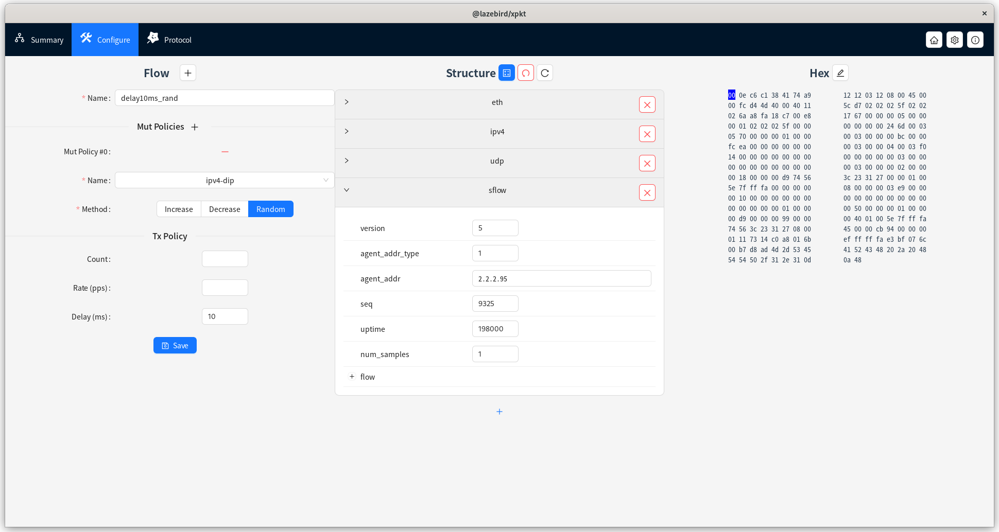
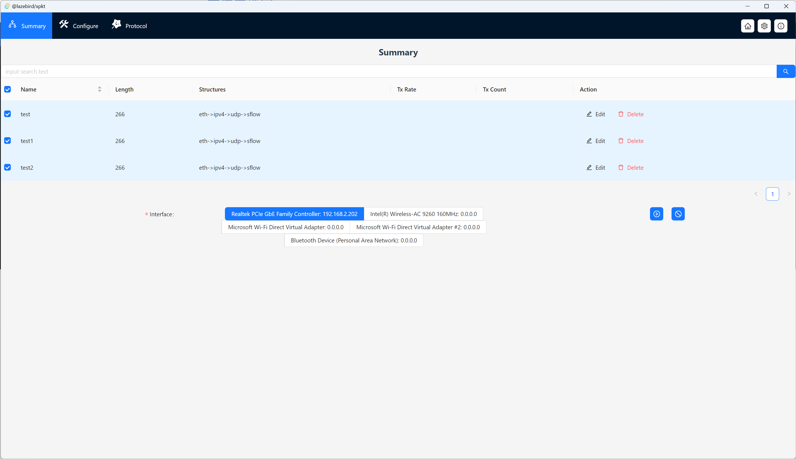
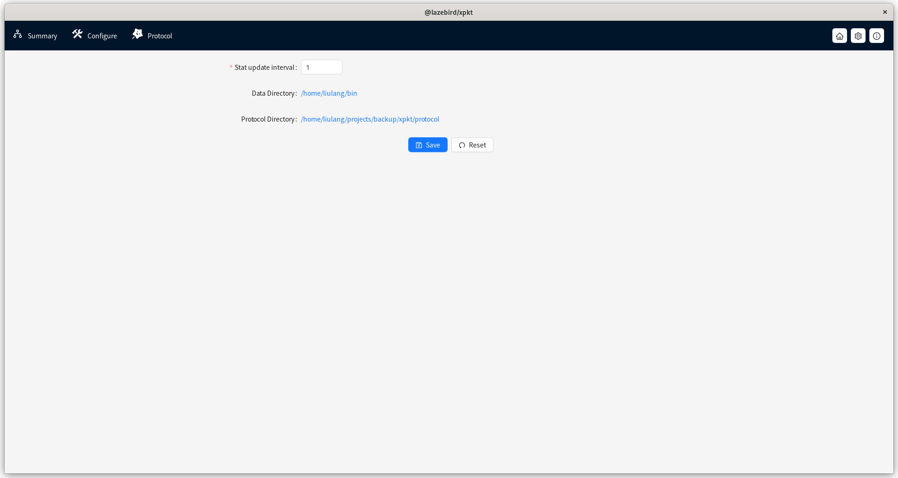

**本仓库作为xpkt软件的发布和维护仓库使用**

[English](./README.md)
# 目录
<!-- TOC -->

- [目录](#%E7%9B%AE%E5%BD%95)
- [背景](#%E8%83%8C%E6%99%AF)
- [xpkt基本介绍](#xpkt%E5%9F%BA%E6%9C%AC%E4%BB%8B%E7%BB%8D)
- [xpkt使用说明](#xpkt%E4%BD%BF%E7%94%A8%E8%AF%B4%E6%98%8E)
    - [xpkt流构建](#xpkt%E6%B5%81%E6%9E%84%E5%BB%BA)
    - [xpkt报文构建](#xpkt%E6%8A%A5%E6%96%87%E6%9E%84%E5%BB%BA)
    - [xpkt流保存](#xpkt%E6%B5%81%E4%BF%9D%E5%AD%98)
    - [xpkt流发送](#xpkt%E6%B5%81%E5%8F%91%E9%80%81)
- [xpkt协议扩展](#xpkt%E5%8D%8F%E8%AE%AE%E6%89%A9%E5%B1%95)
    - [扩展配置](#%E6%89%A9%E5%B1%95%E9%85%8D%E7%BD%AE)
    - [协议处理规则](#%E5%8D%8F%E8%AE%AE%E5%A4%84%E7%90%86%E8%A7%84%E5%88%99)
    - [协议处理ts定义](#%E5%8D%8F%E8%AE%AE%E5%A4%84%E7%90%86ts%E5%AE%9A%E4%B9%89)
- [常见问题](#%E5%B8%B8%E8%A7%81%E9%97%AE%E9%A2%98)
    - [遇到bug或有需求怎么办？](#%E9%81%87%E5%88%B0bug%E6%88%96%E6%9C%89%E9%9C%80%E6%B1%82%E6%80%8E%E4%B9%88%E5%8A%9E)

<!-- /TOC -->

# 背景
- 数通领域开发过程中，经常需要对报文进行调试，会使用到发包工具软件。
- 业界现有anysend/xcap(windows平台)，和packEth(linux平台)，等前辈软件，都有用过，受益匪浅。
- 但是上述软件在使用中存在以下小问题
  - 不能跨平台使用
  - 协议支持不够强大，灵活/扩展性不够
  - 性能一般，大致在1kpps左右
  - 软件更新较慢，遇到小问题也不好解决
- 初步看现有软件都是基于c/c++类低级语言开发(packEth C 大概10kloc)，扩展维护相对困难，因此考虑基于新技术实现一个新的发包工具，也为数通同学们提供多一个选择。在此非常感谢前辈软件们为大家提供的遍历和给本软件带来的启发。

# xpkt基本介绍
- xpkt是一个专业的免费的发包工具软件。具备如下特点：
- **跨平台的发包测试工具**
- 发包：
    - 丰富的发包策略：速率，总数等
    - 支持字段变化：包括mac自增/随机，ip自增/随机，及通用字段类自增/随机
    - 强大的性能，需要基于硬件条件，后期可以做性能测试和对比
    - 多条流并发
- 建包：
    - 直观且强大的报文构造方式
    - 结构化快速编辑+Hex专业编辑并存
    - 兼容主流格式/软件的数据
    - **支持扩展协议解析能力**

# xpkt使用说明
## xpkt流构建

- 点击导航区的`Configure`进入`配置界面`，如上图，点击左侧区域的`Configuration`旁边的`+`，添加全新的流，或者基于当前的流进行修改，以下是基本信息说明：
  - Name：流名称，用于唯一标识一条流
  - Mut Policies：流变化策略，用于在发包期间动态调整报文字段的策略
    - Name：字段名称
    - Position：字段位置，仅当名称为custom自定义时出现，手动配置变化的范围
    - Method：变化方法，当前仅支持减少/增加/随机
    - Step: 变化步幅，仅减少/增加时可配
  - Tx Policy: 发包策略
    - Count: 总的发包数，可选，默认不限制
    - Rate(pps)：发包速率，可选，默认不限制
    - Delay(ms)：每包延迟，可选，默认不限制
- 流基本信息配置完成后，还需要配置具体的报文内容，具体见下一节

## xpkt报文构建
- 报文编辑具备两种模式
  - 结构编辑模式：结构编辑方式指视图左半区的结构化编辑，可以点击底部`+`按钮添加新的字段，并对字段进行修改来实现快速构建报文
  - Hex编辑模式：通过点击视图右半区`Hex`旁边的`笔形图标`进入，可以直接调整报文的Hex数据，调整完后点击同位置的确认按钮完成编辑

## xpkt流保存
- 当流/报文编辑全部完成后，请不要忘记点击`Save`按钮将流保存下来，保存的流会存到配置文件中，即便软件关闭也不会丢失

## xpkt流发送

- 点击`Summary`回到`概览视图`，表格中可以看到所有保存的流，对流进行勾选，同时指定发送的网卡，点击`播放图标`按钮，即可启动发包；点击`停止图标`可以结束发包
- 注意：软件发包需要具备管理员权限

# xpkt协议扩展
## 扩展配置

- 在设置页面中可以通过单击修改`Protocol Directory`的配置，软件会自动加载配置目录下的所有**js文件**，并尝试解析为协议处理文件
- 因此用户可以自行实现协议处理文件，统一放在文件夹内，然后通过配置让软件加载用户自定义的协议处理文件，达到协议扩展的目的

## 协议处理规则
```js
// only core code snippets here
var initval = [0x00, 0x0e, 0xc6, 0xc1, 0x38, 0x41, 0x74, 0xa9, 0x12, 0x12, 0x03, 0x12, 0x08, 0x00];
const etypeOpts = [ { label: 'ipv4', value: '0x0800' }, { label: 'arp', value: '0x0806' } ];
function decode(arr, start) {
  var config = {
    key: 'eth',
    pos: [start, start + 13],
    children: [
      { key: 'dmac', value: array2mac(arr.slice(start, start + 6)), type: 'mac', pos: [start, start + 5], change: (arr, e) => mac_change(arr, e.pos, e.value) },
      { key: 'smac', value: array2mac(arr.slice(start + 6, start + 12)), type: 'mac', pos: [start + 6, start + 11], change: (arr, e) => mac_change(arr, e.pos, e.value) },
      { key: 'etype', value: num2hex(array2num(arr.slice(start + 12, start + 14))), options: etypeOpts, pos: [start + 12, start + 13], change: (arr, e) => num_change(arr, e.pos, e.value, 2) },
    ],
  };
  return config;
}
export default { name: 'eth', parents: 'none', initval: initval, decode: decode };
```
- 如上为eth协议处理文件片段，更多协议可以参考`/protocol`目录下的内置协议处理脚本；各字段更多细节可以参考ts定义

## 协议处理ts定义
- 参考[protocol.d.ts](./types/protocol.d.ts)
```ts
interface ProtocolDecodeFn {
  (_arr: Array<number>, _start: number): ProtocolConfig;
}

interface ProtocolChangeFn {
  (_arr: Array<number>, _e: ProtocolConfig): Array<number>;
}

interface ProtocolCheckFn {
  (_arr: Array<number>, _e: ProtocolConfig): any;
}
interface ProtocolUpdateFn {
  (_arr: Array<number>, _e: ProtocolConfig): Array<number>;
}

export interface ProtocolParentItem {
  name: string;
  pname: string;
  pval: any;
}
export interface ProtocolConfig {
  key: string;
  pos: Array<number>;
  children?: Array<ProtocolConfig>;
  type?: 'number' | 'mac' | 'ipv4' | 'hex' | 'pkt';
  value?: any;
  options?: Array<any>;
  status?: 'error';
  change?: ProtocolChangeFn;
  check?: ProtocolCheckFn;
  update?: ProtocolUpdateFn;
}
export interface ProtocolItem {
  name: string;
  priority?: number;
  parents: string | Array<ProtocolParentItem>;
  initval: Array<number>;
  decode: ProtocolDecodeFn;
}
```

# 常见问题
## 遇到bug或有需求怎么办？
- 可以在GitHub上面提交issue，虽然是业余爱好，但是会尽量解决
