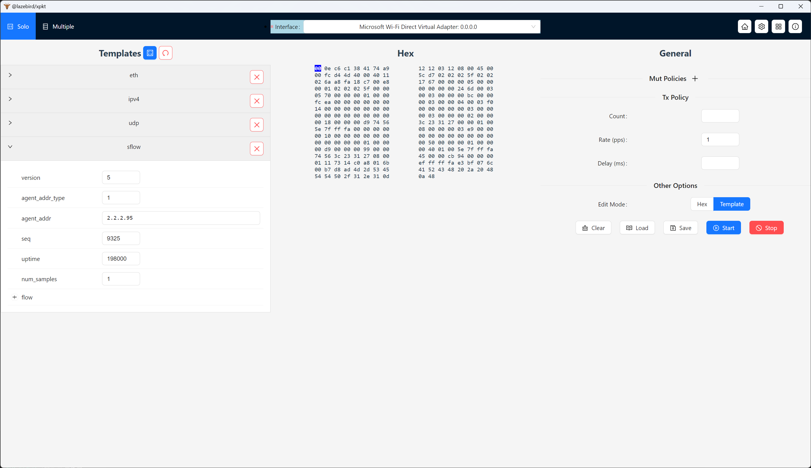
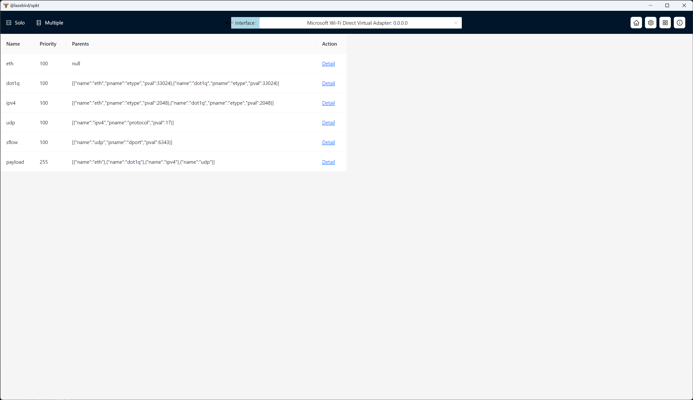

**本仓库作为xpkt软件的发布和维护仓库使用**

[English](./README.md)
# 目录
<!-- TOC -->

- [目录](#%E7%9B%AE%E5%BD%95)
- [背景](#%E8%83%8C%E6%99%AF)
- [xpkt基本介绍](#xpkt%E5%9F%BA%E6%9C%AC%E4%BB%8B%E7%BB%8D)
- [xpkt使用说明](#xpkt%E4%BD%BF%E7%94%A8%E8%AF%B4%E6%98%8E)
    - [xpkt流构建](#xpkt%E6%B5%81%E6%9E%84%E5%BB%BA)
    - [xpkt流保存](#xpkt%E6%B5%81%E4%BF%9D%E5%AD%98)
    - [多流模式](#%E5%A4%9A%E6%B5%81%E6%A8%A1%E5%BC%8F)
- [xpkt协议扩展](#xpkt%E5%8D%8F%E8%AE%AE%E6%89%A9%E5%B1%95)
    - [开发说明](#%E5%BC%80%E5%8F%91%E8%AF%B4%E6%98%8E)
    - [使用扩展协议](#%E4%BD%BF%E7%94%A8%E6%89%A9%E5%B1%95%E5%8D%8F%E8%AE%AE)
    - [协议处理规则](#%E5%8D%8F%E8%AE%AE%E5%A4%84%E7%90%86%E8%A7%84%E5%88%99)
    - [协议处理ts定义](#%E5%8D%8F%E8%AE%AE%E5%A4%84%E7%90%86ts%E5%AE%9A%E4%B9%89)
- [常见问题](#%E5%B8%B8%E8%A7%81%E9%97%AE%E9%A2%98)
    - [遇到bug或有需求怎么办？](#%E9%81%87%E5%88%B0bug%E6%88%96%E6%9C%89%E9%9C%80%E6%B1%82%E6%80%8E%E4%B9%88%E5%8A%9E)

<!-- /TOC -->
<!-- /TOC -->
# 背景
- 数通领域开发过程中，经常需要对报文进行调试，会使用到发包工具软件。
- 业界现有anysend/xcap(windows平台)，和packEth(linux平台)，等前辈软件，都有用过，受益匪浅。
- 但是上述软件在使用中存在以下小问题
  - 不能跨平台使用
  - 协议支持不够强大，灵活/扩展性不够
  - 性能一般，大致在1kpps左右
  - 软件更新较慢，遇到小问题也不好解决
- 初步看现有软件都是基于c/c++类低级语言开发(packEth C 大概10kloc)，扩展维护相对困难，因此考虑基于新技术实现一个新的发包工具，也为数通同学们提供多一个选择。在此非常感谢前辈软件们为大家提供的便利和给本软件带来的启发。

# xpkt基本介绍
- xpkt是一个专业的免费的发包工具软件。具备如下特点：
- **跨平台的发包测试工具**
- 发包：
    - 丰富的发包策略：速率，总数等
    - 支持字段变化：包括mac自增/随机，ip自增/随机，及通用字段类自增/随机
    - 强大的性能，需要基于硬件条件，后期可以做性能测试和对比
    - 多条流并发
- 建包：
    - 直观且强大的报文构造方式
    - 结构化快速编辑+Hex专业编辑并存
    - 兼容主流格式/软件的数据
    - **支持扩展协议解析能力**

# xpkt使用说明
## xpkt流构建

- 点击导航区的`Solo`进入单流配置模式。点击右下角的`Edit Mode`可以切换配置方式，可选基于模板的配置和基于十六进制数据方式
- 配置完成后，点击`Start`或`Stop`就可以进行打流了
- 注意：软件发包需要具备管理员权限

## xpkt流保存
- 点击`Save`按钮可以将流保存下来，保存的流会存到配置文件中，即便软件关闭也不会丢失
- 多流模式需要基于此处保存的流信息进行

## 多流模式

- 点击`Multiple`进入多流模式，表格中可以看到所有保存的流，对流进行勾选，点击`Start`或`Stop`就可以进行打流了
- 注意：软件发包需要具备管理员权限

# xpkt协议扩展
## 开发说明
- 扩展协议可以参考本仓库protocol目录，项目原生使用ts语言，protocol目录是protocol_ts目录执行`pnpm tsc`生成的，有部分修改。最终被软件读取的是protocol目录。
- 用户可以基于本仓库建立自己的protocol目录，提供各种定制的协议扩展。也欢迎大家提交PR分享各自的protocol实现。

## 使用扩展协议

- 在设置页面中可以通过单击修改`Protocol Directory`的配置，软件会自动加载配置目录下的所有**js文件**，并尝试解析为协议处理文件
- 因此用户可以自行实现协议处理文件，统一放在文件夹内，然后通过配置让软件加载用户自定义的协议处理文件，达到协议扩展的目的


## 协议处理规则
```js
// only core code snippets here
var initval = [0x00, 0x0e, 0xc6, 0xc1, 0x38, 0x41, 0x74, 0xa9, 0x12, 0x12, 0x03, 0x12, 0x08, 0x00];
const etypeOpts = [ { label: 'ipv4', value: '0x0800' }, { label: 'arp', value: '0x0806' } ];
function decode(arr, start) {
  var config = {
    key: 'eth',
    pos: [start, start + 13],
    children: [
      { key: 'dmac', value: array2mac(arr.slice(start, start + 6)), type: 'mac', pos: [start, start + 5], change: (arr, e) => mac_change(arr, e.pos, e.value) },
      { key: 'smac', value: array2mac(arr.slice(start + 6, start + 12)), type: 'mac', pos: [start + 6, start + 11], change: (arr, e) => mac_change(arr, e.pos, e.value) },
      { key: 'etype', value: num2hex(array2num(arr.slice(start + 12, start + 14))), options: etypeOpts, pos: [start + 12, start + 13], change: (arr, e) => num_change(arr, e.pos, e.value, 2) },
    ],
  };
  return config;
}
export default { name: 'eth', parents: 'none', initval: initval, decode: decode, allow_payload: true };
```
- 如上为eth协议处理文件片段，更多协议可以参考`/protocol`目录下的内置协议处理脚本；各字段更多细节可以参考ts定义

## 协议处理ts定义
- 参考[protocol.d.ts](./types/protocol.d.ts)
```ts
interface ProtocolDecodeFn {
  (_arr: Array<number>, _start: number): ProtocolNode;
}

interface ProtocolChangeFn {
  (_arr: Array<number>, _e: ProtocolNode): Array<number>;
}

interface ProtocolCheckFn {
  (_arr: Array<number>, _e: ProtocolNode): any;
}
interface ProtocolCalcFn {
  (_arr: Array<number>, _e: ProtocolNode): Array<number>;
}

export interface ProtocolParentConfig {
  name: string;
  pname?: string;
  pval?: any;
}
export interface ProtocolNode {
  key: string;
  pos: Array<number>;
  children?: Array<ProtocolNode>;
  type?: 'number' | 'mac' | 'ipv4' | 'ipv6' | 'hex' | 'pkt';
  value?: any;
  options?: Array<any>;
  status?: 'error';
  change?: ProtocolChangeFn;
  check?: ProtocolCheckFn;
  calc?: ProtocolCalcFn;
}
export interface ProtocolConfig {
  name: string;
  priority?: number;
  parents: Array<ProtocolParentConfig> | null;
  initval: Array<number>;
  decode: ProtocolDecodeFn;
  allow_payload?: boolean;
}
```

# 常见问题
## 遇到bug或有需求怎么办？
- 可以在GitHub上面提交issue，虽然是业余爱好，但是会尽量解决
